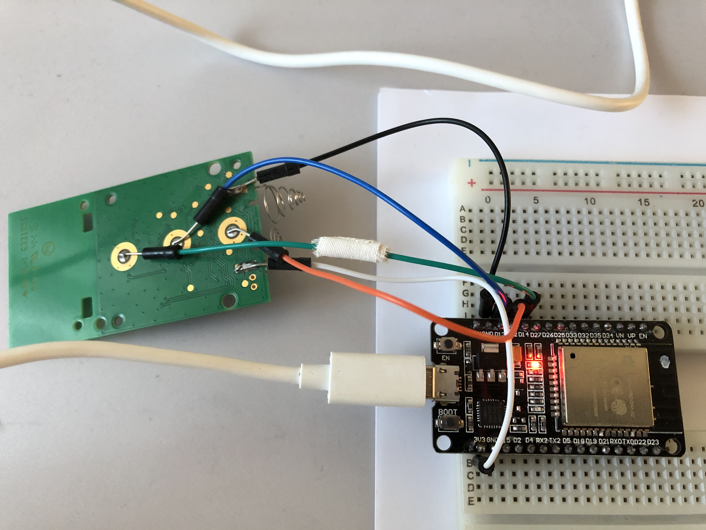
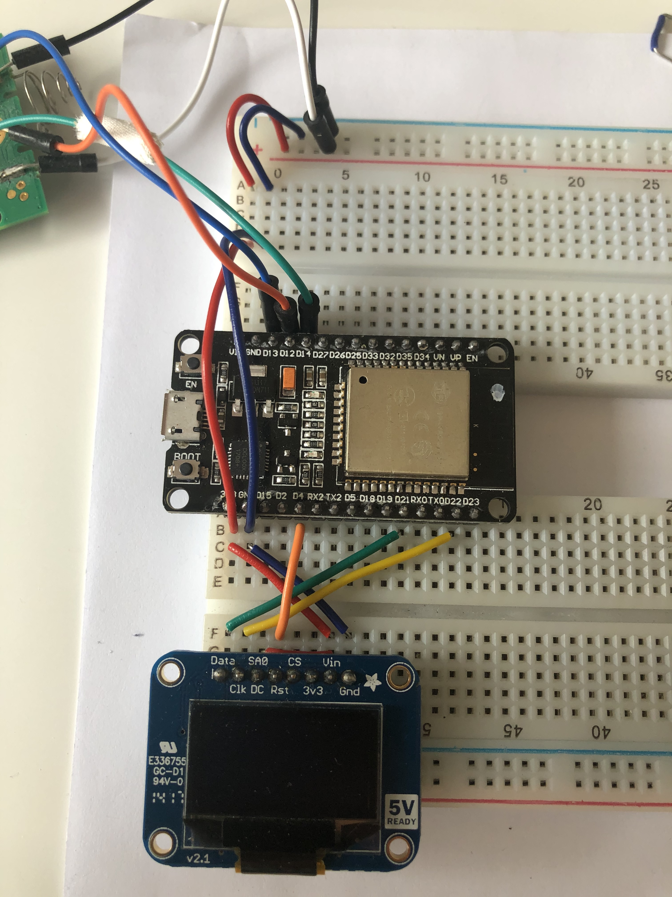
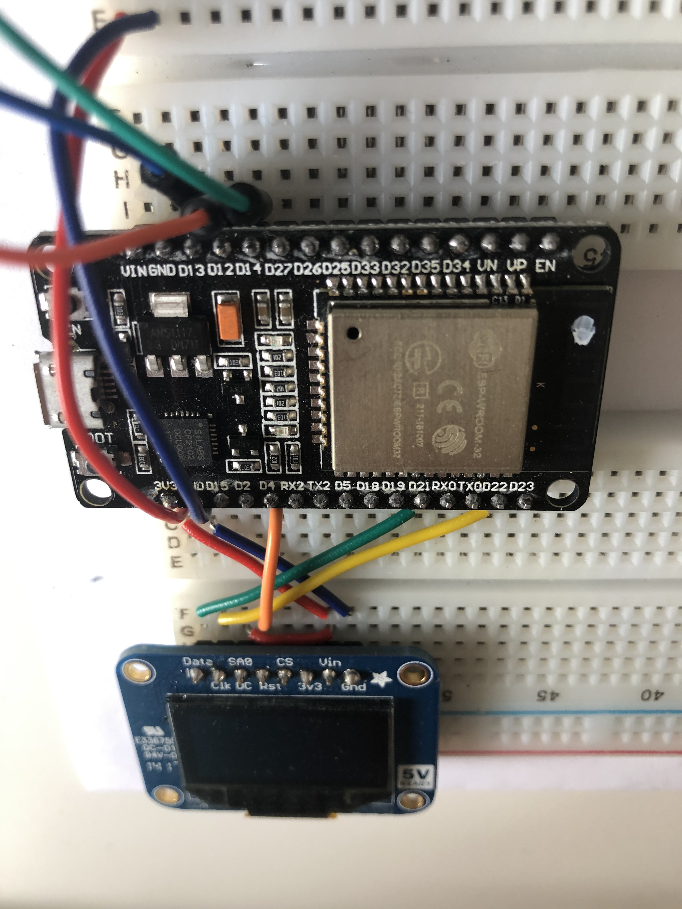
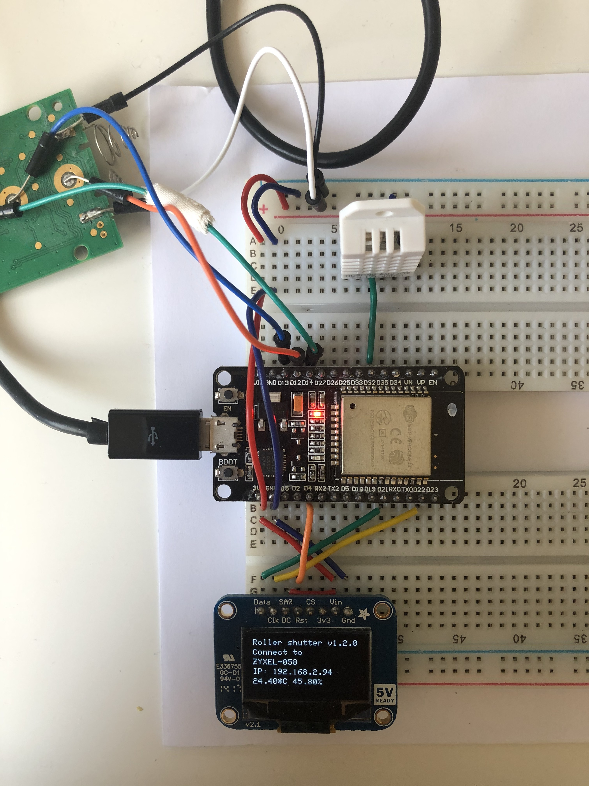

# RollerShutterFirmware: Firmware for an esp32 to control VELUX INTEGRA shutters
Authors: Simon Bogutzky

License: [MIT](https://opensource.org/licenses/MIT)

Version: 1.2.0

Document version: 1.2.1 

Date: 30/05/2020

## What is the RollerShutterFirmware?
The RollerShutterFirmware is a firmware for an esp32 to control for example VELUX INTEGRA via an integrated web server or the [RollerShutterApp](https://github.com/sbogutzky/RollerShutterApp/).

## Using the RollerShutterFirmware

### Hardware Installation Instructions
I use for the wireless connection a NodeMCU-32S ESP32 development board (similar to [Waveshare NodeMCU-32S ESP32 Development Board](https://www.amazon.com/dp/B07TXNK6P1/ref=cm_sw_em_r_mt_dp_U_DbcMEbPJSWKTA)), based on the popular [ESP32](http://espressif.com/) chipset.

I open the remote of the VELUX INTEGRA shutters and add wires to the three buttons, to the power supply and the ground. The buttons are connected (up, green wire) to D14, (stop, blue wire) to D13 and (down, orange wire) to D12 of the development board. 



*esp32 outs*

Putting the NodeMCU-32S ESP32 development board in bootloader mode:  

1. press and hold the BOOT button
2. press the Upload button in the Arduino IDE
3. after the message "Connecting..." appears in the Arduino IDE, release the BOOT button

### Adding SPI OLED Display

In the next step I add an Adafruit SSD1306 128x64 display to show all information from the serial console on the display. You have to add the display parallel to the remote. Do not forget to add 3v3 to Vin and DC. 



*Parallel circuit*



*Vin DC connection*

### Adding DHT

In the last step I add a humidity and temperature sensor AM2302 DHT22

* Pin 1 = 3v3
* Pin 2 = Data (D32)
* Pin 4 = Ground

### Programming ESP32 Development Board in the Arduino IDE

Download the [Arduino IDE](https://www.arduino.cc/en/Main/Software). 

*I use macOS Catalina and the Version 1.8.12. The IDE uses Python and you have to create the right links to it. Type in the terminal:*

```
sudo ln -s /usr/bin/python3 /usr/local/bin/python3
sudo mkdir /usr/local/bin/
```
Arduino IDE offers support for esp32. All you have to do is to go to File / Preferences, and on Additional Boards Manager URL add “https://dl.espressif.com/dl/package_esp32_index.json”. In Arduino IDE, Tools, setup the communication to board. I select: DOIT ESP32 DEVKIT V1. I use [ESP32Webserver](https://github.com/Pedroalbuquerque/ESP32WebServer) for this project. Do not forget to put the development board into firmware download mode before uploading your code.

I use the SDD1306 library by [Adafruit](https://github.com/adafruit/Adafruit_SSD1306) for the programming.

For the DHT I use the library by [Adafruit](https://github.com/adafruit/DHT-sensor-library). I add a timer to read the values of DHT only every 10 seconds. Unfortunetly the display is cleared every 10 seconds. How can I prevent a whole refresh???

### Example Usage

Open the *.ino file and upload the firmware. Replace 

```
const char* ssid = "";
const char* password = "";
```

with your WiFi settings.

On the display you will see the IP address of the webserver e. g. 192.168.2.94. The display shows the command if a command comes from the webserver. In the meantime it shows the humidity and the temperature.



*Working display and DHT*

In your favorite browser you can type the following commands in the address bar:

```
http://192.168.2.94/up - for moving the shutters up
http://192.168.2.94/stop - for stopping the shutters
http://192.168.2.94/up - for moving the shutters down
http://192.168.2.94/version - getting the firmware version
```

You can also use the [RollerShutterApp](https://github.com/sbogutzky/RollerShutterApp/). Make sure you change the IP address in the source code of the platform code.

## Author and Contribution
As by the License this is free software released by the Simon Bogutzky. The author (Simon Bogutzky) welcomes external contributors to freely use and extend this software. If you need some help, please write an [issue](https://github.com/sbogutzky/RollerShutterFirmware/issues).
